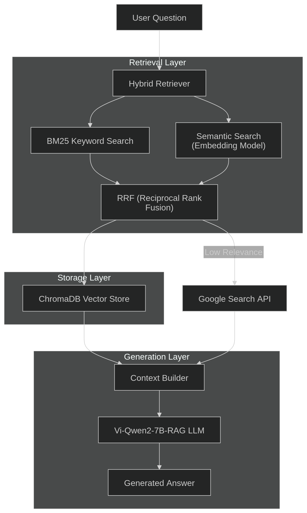
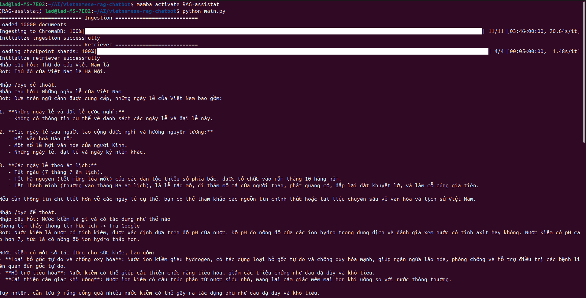
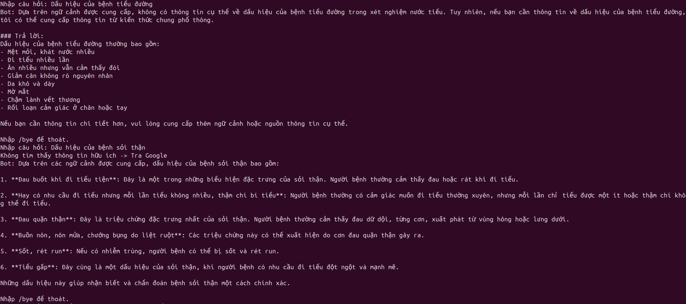

# Vietnamese RAG Chatbot

A **Retrieval-Augmented Generation (RAG) chatbot for Vietnamese**, combining hybrid search (semantic + keyword retrieval) with a Vietnamese-optimized Large Language Model to generate accurate, context-grounded responses.

## 📌 Introduction

Large Language Models often hallucinate when answering factual questions. This issue becomes more serious for **Vietnamese**, where high-quality RAG systems are less available.

This project builds a **hybrid RAG pipeline** that:

- Retrieves relevant documents using both semantic embeddings and keyword search (BM25)
- Generates grounded answers using a Vietnamese LLM
- Falls back to web search when local retrieval fails
- Evaluates performance using RAGAS metrics

The goal is to create a **more reliable Vietnamese question-answering system**.

## ✨ Key Features

- **LLM Engine:** Powered by the `AITeamVN/Vi-Qwen2-7B-RAG` model with quantized version for native, high-fidelity Vietnamese text generation and memory efficiency
- **Vector Database:** Utilizes **ChromaDB** for fast, local vector storage and retrieval.
- **Hybrid Search:** Implements a robust retrieval pipeline combining **Semantic Search** (dense vector embeddings) and **BM25** (sparse keyword matching) to maximize document relevance with RRF score for ranking
- **Smart Fallback Mechanism:** If the hybrid search fails to find a high-confidence match in the local vector database, the system automatically falls back to **Google Search** to retrieve real-time, external information.
- **Customizable Prompting:** Easy-to-edit system prompts to adjust the assistant's behavior and response boundaries.

## 🏗️ System Architecture


## 🛠️ How to Use the Repo

### 1. Requirements
### Software
- Python 3.10+
- pip
- CUDA (optional, but recommended for GPU acceleration)

### Hardware
- Minimum 16GB RAM
- GPU recommended (8GB+ VRAM for 7B model)
- CPU-only mode works but slower


### 2. Installation
Clone this repository and install the required dependencies:

```bash
git clone https://github.com/Lad1411/vietnamese-rag-chatbot.git
cd vietnamese-rag-chatbot
pip install -r requirements.txt
```

### 3. Environment Setup
Generate a Google Custom Search API key: https://developers.google.com/custom-search/docs/paid_element#api_key


Create a .env file in the `Retrieval_pipeline` directory of the project to configure your API keys (required for the Google Search fallback):
```bash
GOOGLE_CSE_ID = ""
GOOGLE_API_KEY = ""
```

### 4. Running the chatbot
```bash
python main.py
```


## 📊 Evaluation
This project is evaluated using **RAGAS** (Retrieval-Augmented Generation Assessment) to measure retrieval quality, generation correctness, and overall end-to-end RAG performance. 

The evaluation framework ensures the Vietnamese RAG chatbot produces accurate, grounded, and context-aware responses.

---

### 1. Generation Evaluation

We evaluate the generation module independently to verify that the language model produces correct answers based on the provided context.

#### Correctness Metric (RAGAS)

```python
correctness_metric = DiscreteMetric(
    name="correctness",
    prompt="""Compare the model response to the expected answer and determine if it's correct.
Consider the response correct if it:
1. Contains the key information from the expected answer
2. Is factually accurate based on the provided context
3. Adequately addresses the question asked

Return 'pass' if the response is correct, 'fail' if it's incorrect.

Question: {question}
Expected Answer: {expected_answer}
Model Response: {response}

Evaluation:""",
    allowed_values=["pass", "fail"],
)
```

### 2. Retrieval evaluation
```python
context_metric = DiscreteMetric(
    name="context",
    prompt="""Compare the model retrieved context to the expected answer and determine if it is adequate.
Consider the context adequate if it:
1. Contains the key facts necessary to answer the question correctly.
2. The information in the expected answer can be fully supported using only the retrieved context.
3. Minor wording differences or paraphrasing are acceptable.

Return 'pass' if the response is adequate, 'fail' if important information is missing

Question: {question}
Expected Answer: {expected_answer}
Retrieved context = {contexts}
Evaluation:""",
    allowed_values=["pass", "fail"]
)
```

### 3. Result

| Evaluation Type | Metric                  | Score |
| :--- |:------------------------|:------|
| Retrieval | Context metric          | 83.5% |
| Generation | Correctness (Pass Rate) | 100%  |
| End-to-End | Correctness (Pass Rate) | 97.5% |


## 🤖 Chatbot Demo
